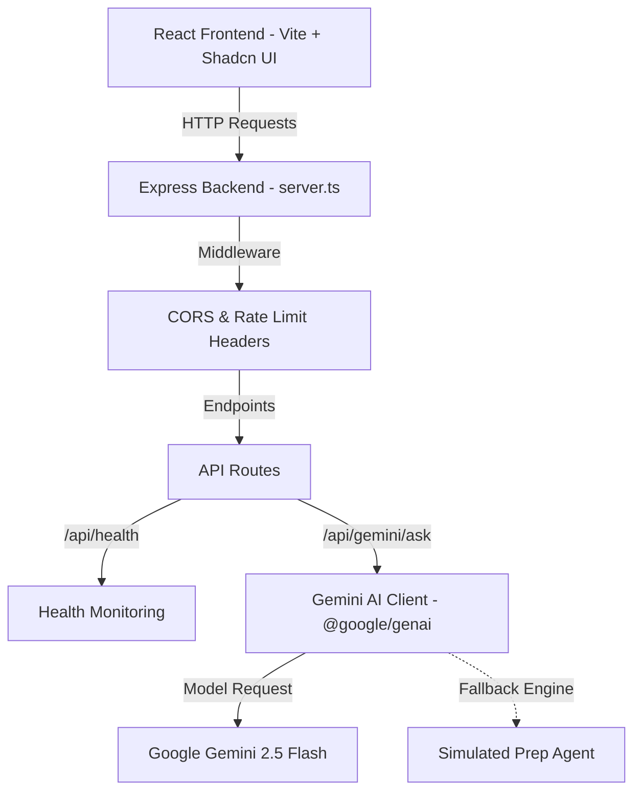

# PrepPath Repo 🎓

[](https://github.com/user/preppath-repo/actions)


PrepPath Repo is an AI-enhanced exam preparation platform featuring interactive learning paths, diagnostic study schedules, and intelligent tutoring powered by `@google/genai`.

---

## 🏗️ System Architecture



---

## ✨ Features

- **AI Study Assistant**: Specialized `/api/gemini/ask` agent for exam preparation advice and subject tutoring.
- **Full-Stack Express Server**: Production-grade `server.ts` setup with security headers and CORS.
- **Robust Error Handling & Fallbacks**: Reliable operation even when `GEMINI_API_KEY` is omitted.
- **Automated Vitest Test Suite**: Full unit testing coverage in `tests/api.test.ts`.
- **CI/CD Pipeline**: GitHub Actions workflow for linting, testing, and building.

---

## 🔑 Environment Variables

```env
PORT=3002
GEMINI_API_KEY=your_google_gemini_api_key_here
```

| Variable | Required | Description | Default |
| :--- | :--- | :--- | :--- |
| `PORT` | No | Server port | `3002` |
| `GEMINI_API_KEY` | Recommended | Google Gemini API Key | `""` (Fallback mode active) |

---

## 📡 API Documentation

### 1. Health Check
- **Endpoint**: `GET /api/health`
- **Response**:
```json
{
  "status": "ok",
  "service": "preppath-repo-backend",
  "version": "1.0.0",
  "timestamp": "2026-08-12T12:00:00.000Z",
  "gemini_configured": true
}
```

### 2. Gemini AI Tutoring Agent
- **Endpoint**: `POST /api/gemini/ask`
- **Request Body**:
```json
{
  "prompt": "How do I solve quadratic equations using completing the square?",
  "context": "SAT Math Preparation",
  "systemInstruction": "You are an encouraging math tutor."
}
```

---

## ⚡ Quick Start

```bash
# Installation
npm install

# Start Backend Server
npm run server

# Start Frontend Dev Server
npm run dev

# Run Vitest Suite
npm test
```
